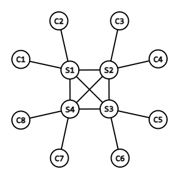

# Mesh

Mesh is a decentralised, encrypted chat protocol. It allows users to send instant messages across a network of crowdsourced servers, which store and deliver messages to users who encrypt and sign them end-to-end.

The advantage of such a protocol is that people can communicate in complete privacy, and without relying on centralised servers. This gives more power to the users, and better scalability for the whole system (see Signal's issues after [Elon Musk tweeted](https://twitter.com/elonmusk/status/1347165127036977153)).

It also takes the federated model (e.g. email) further by untethering user identity from an authoritative server. This is achieved by having users addressed by their public keys, which are short enough thanks to elliptic curve cryptography (ECC). However, unlike with P2P, Mesh can deliver messages while both users in an exchange are offline.

## Overview

The main focus of this project is the protocol design and its prototype implementation, which will be in JavaScript due to my familiarity with that language. A simple terminal frontend will allow a user to send and receive messages. In reality, this would probably occur through a mobile app.

Mesh essentially works by providing a distributed hash table of message queues, featuring a simple complete network topology, and consistent hashing. Servers would be provided by technical-minded members of the community.

### Server discovery

Any node or user of the network discovers the whole network through a bootstrapping process. Knowledge of only one server address (or domain name) is required, as the list can be updated by contacting those known nodes. Through this process, all servers reach a consensus about what nodes exist in the network.

Once an end-user is bootstrapped, they choose a residence server, which provides a channel for communicating with other users. This selection process is known as consistent hashing, whereby a user's hashed identifier and each server's hashed address are compared in a cicular hash-space.

A user's residence server is the node which is most proximal in this hash-space. Because consistent hashing is deterministic, two users can both reach agreement on their residences before ever communicating. This method is also reasonably uniform and unpredictable, preventing a server from rigging its hash-space location, and providing scalability through load balancing.

A user maintains a persistent, full-duplex connection with their residence server. For this prototype, mainly the application-layer protocol WebSocket will be used, which is TCP-like but also event-driven.

### Message delivery

To send a message, a user emits it to their residence server. The server then determines the recipient's residence server in the network, and forwards it. Once received, it is placed in a message queue assigned to the recipient. These queues are essentially what the keys (user IDs) map to in a distributed hash table.

The recipient does not have to be online to receive this message. The queue is maintained until the recipient reconnects, at which time that data is dumped to the recipient, and deleted from the queue. In this way, clients maintain their own long-term storage of message history, but servers provide short-term storage to facilitate asynchronous messaging.

### Encryption

Because the Mesh network is an untrusted medium, and due to a lack of centralised identity management, users must handle encryption and authentication independently. When a user is created, they generate an Elliptic Curve Diffie-Hellman (ECDH) keypair. The public key is also used as their user ID, so EC has been chosen due to its economical key sizes.

Before a message can be sent, a shared secret is generated with the ECDH algorithm. Each user only requires the public key of the other to do so, meaning this secret is never transmitted. Once the secret has been created, the message is encrypted with it and sent over the network. The recipient then decrypts it, and can be assured of who sent it and that no one else can read it.

### Protocols

Mesh is made up of two parts, the core and chat protocols. The core isn't specific to a single service, rather providing general functionality like server discovery, message (in the general sense) delivery. Meanwhile, the chat protocol contains the specifics of events needed by a chat service, like message metadata, user info, and typing events.

## Core protocol

### Keys and addressing

Each new user generates their own ECDH keypair with the secp256k1 curve. The public and private key sizes are 33 bytes and 32 bytes, respectively. The public key is that user's permanent ID. This ID should usually be presented to humans as a Base58-encoded string, or some other representation of that (such as a QR code).

### Hash-space

User IDs (public keys) and server IDs (domain names or IP addresses) are mapped into a shared circular hash-space via SHA3-256. The proximity between two objects is defined as either their hash difference, or the domain size minus their hash difference – whichever is smallest. For example, two objects at the very edges of non-circular hash-space are considered to be at the same location in the circular representation.

### Network topology

The core network of servers is interconnected as a complete network graph, for the simplicity of this prototype. These are long-lived WebSocket connections. Any changes to the network structure, such as a node joining or leaving, are detected by all nodes instantly.

Around this core, users connect to a single node with a similar WebSocket connection. This node is chosen is known as the residence server, and is the most proximal node in hash-space.

### Server list format

The list of servers is transmitted as UTF-8 text. Each entry is in the format `address:port`, where `address` is a domain name or IP address. If it is an IPv6 address, it is wrapped with brackets (`[]`), to avoid ambiguity with the port number.

Each entry is separated by a newline and/or carriage return character. The trailing newline is optional. Additional whitespace (per Unicode) should be ignored.

### Bootstrapping

New users and servers should have at least a partial list servers provided to them with whatever, usually bundled the application or library implementing the protocol. Before a user chooses a residence, this list must be updated to the latest version.

Servers provide an HTTP GET endpoint `/discover` which servers the list. This is the only HTTP endpoint, as most communication is conducted over WebSocket.

While servers establish WebSocket communication to every server, users choose one as their residence. Users may also poll non-residence servers periodically to strengthen their confidence in the list.

Both users and servers should permanently store this list, for quicker bootstrapping should a restart occur.

### WebSocket communication

All communication via WebSocket is event-driven and encoded with UTF-8 JSON. All messages should follow this format:

`["eventName", {key: value, ...}]`

The first item of this array, the event name, is required and a string. By convention, it should be written in camel case.

The second item, the payload, is optional. Its omission is equivalent to `{}`. If it is included, it must be an object. The number, values, and depth of these items is unconstrained. However, camel-case keys are conventional.

### Server-to-server communication

All servers connect to each other and are considered equals in these connections, unlike with client-to-server communication. However, establishing a WebSocket connection requires a notion of clients and servers (with clients initiating connections).

The server that was running first is considered the server. So, a new node joining the network is a client to all the other servers. However, it possible that two connections are established at once between nodes. This may happen if both start at the same time, or a known server reconnects to the network.

This is resolved by setting the node greater in hash-space as the server, meaning that the connection where that node is client is closed.

Once the connection is established, these events may be sent:

- "discover": `{list: string}`
  - `list` is in [server list format](#server-list-format)
  - sent by both nodes immediately after connecting
  - upon receiving the list, a node merges it into their own (i.e. concatenating and removing duplicates)
  - connections are established with any new servers in the list
- "deliver": `{to: string, from: string, timeSent: integer, content: string}`
  - `to` and `from` are the public keys of the sender and recipient, respectively
  - `timeSent` is a Unix timestamp in milliseconds
  - `content` is a Base64-encoded string representing an encrypted payload

Upon disconnection, the disconnected node is removed from the lists of active nodes.
